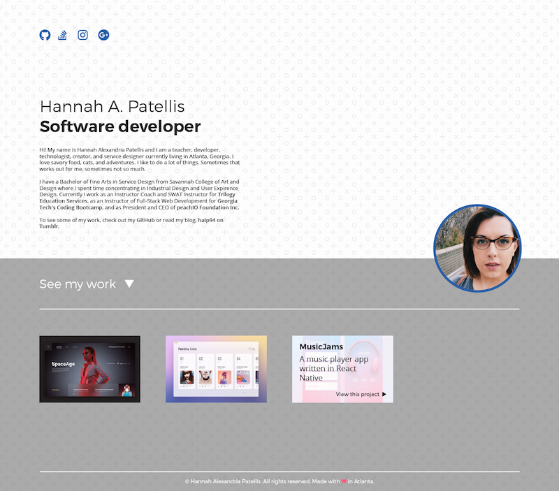
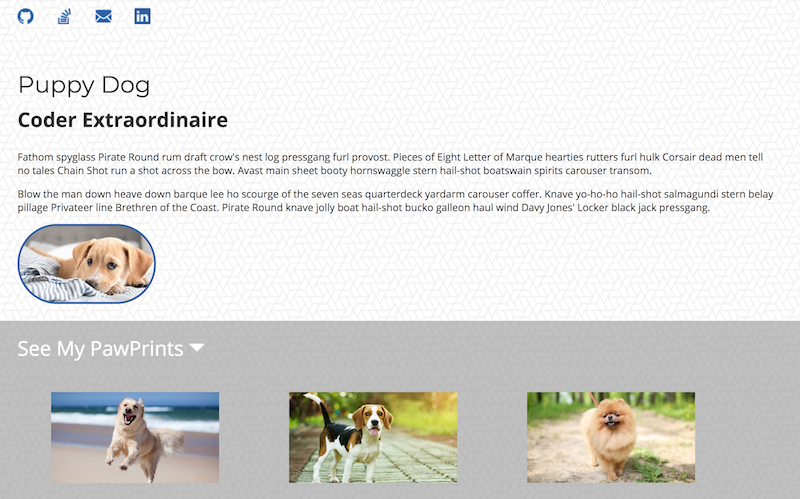

# Homework 1 - Portfolio and Programming Fundamentals

There are **2 parts** to this homework. The homework is only complete if **both** parts are submitted.

Homework is only incomplete if 1 or more parts are not submitted. Non-working code is **not** an incomplete. Please turn in any code you have. 

**This homework is due Saturday August 18th at 5pm.** Late submissions are not accepted. 

## Part 1: Portfolio

As a developer, an important part of your job is matching the design teams files **exactly**. In the interest of matching the work environment as closely as possible, all of your homeworks will include a design file that must be matched. 

You will be working up to building this layout over the next two weeks:

*This week*, work on completing the first portion of your portolio. What you're turning in this week should look like the image below.

Everything you need to get started is in the `starter` folder. 

Follow the instructions below: 

* Copy the files inside the `starter` folder and paste them inside your `bc` > `Homework` > `01-Unit` folder. 

* Read these short articles on how to link to images in your `assets` folder 

  * [https://www.w3schools.com/html/html_filepaths.asp](https://www.w3schools.com/html/html_filepaths.asp)

  * [https://css-tricks.com/quick-reminder-about-file-paths/](https://css-tricks.com/quick-reminder-about-file-paths/)

* In `index.html`, use semantic HTML to add the following

  * Four icons (github, email, stackoverflow, linkedin) (included in assets)

  * Your Name

  * A Short Title like `Software Developer`, `Front-End Developer`, `JavaScript Nerd`, or the like 

  * A couple short paragraphs about you

  * Some text that says `See My Work` or `View Portfolio` or something similar with an arrow beside it (arrow included assets)

  * A picture of you

  * 3 sample portfolio images (included in assets)

  * A footer with a copyright

* In your `style.css` do all of the following:

  * Use the Google Font `Montserrat` for headers and `Open Sans` for all other text.

  * Set the background of the whole document to the `bckgrnd.png` image in assets. Make sure the background repeats.

  * The lower section of the page should have a background color `#969696` with 60% opactity (rgb 150, 150, 150). 

  * Add a `3px` border to your profile picture with the color `#2c5fa8` (you'll need to Google the terms CSS IDs and Classes to target this specific image.)

  * Add a width of `200px`to your profile picture and a border radius of `100px` (bonus points if you crop the image to be a square and make a circle with the border radius) 

  * Add a white top border to your footer.

  * Add the appropriate color for text in the top and bottom sections, `#333333` and `#FFFFFF`. 

  * Set appropriate margins, padding, and widths to match the image below.

  

  ---

  ## Part 2: Programming Fundamentals

  Read the following article: [https://github.com/getify/You-Dont-Know-JS/blob/master/up%20%26%20going/ch1.md](https://github.com/getify/You-Dont-Know-JS/blob/master/up%20%26%20going/ch1.md)

  * You may need to read the article several times to fully understand it. 

  * You may need to Google concepts that you don't fully understand. 

  * When you fully understand the article, write a synopsis as though you are explaining the concepts to a ten year old. 

  * Your summary must be at least 150 words.
  
  * Your summary must include one analogy. Example "A conditional is like a fork in the road. You go one way if you want to go home and another if you want to go to work"

  

